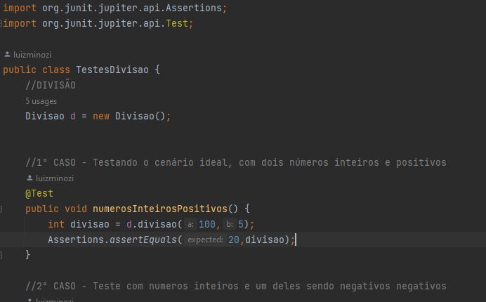

# Calculadora - Qualidade e Testes de Software
## Descrição
A calculadora foi criada a partir das 4 operações básicas da matemática para testar principios de qualidade e testes de software

## Funcionamento
Neste modelo foi utilizado o JUnityTest para realização de cada teste individualmente, podendo assim passar por todos mesmo que algum de erros. Assim como segue a imagem abaixo de um exemplo do uso da extensão nos testes.

## Última atualização 21/09/23
