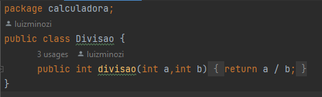
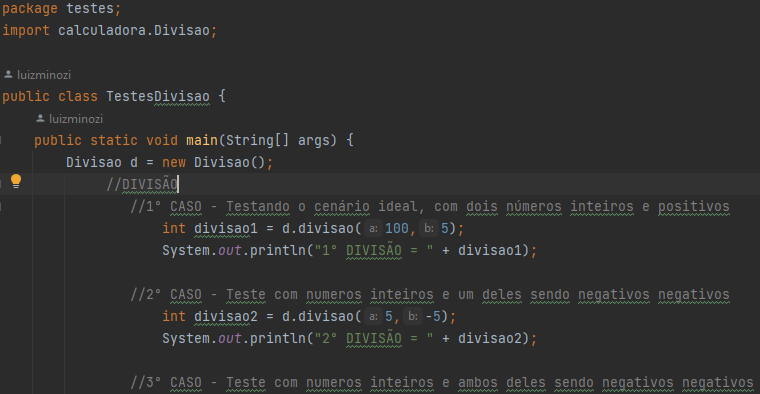

# Calculadora - Qualidade e Testes de Software
## Descrição
A calculadora foi criada a partir das 4 operações básicas da matemática para testar principios de qualidade e testes de software

## Funcionamento
Foi-se criado diversos cenários para que a qualidade do código-fonte da calculadora fosse posto a prova, assim como segue nos exemplos abaixo de uma operação e seus respectivos testes.

## Última atualização 20/09/23
